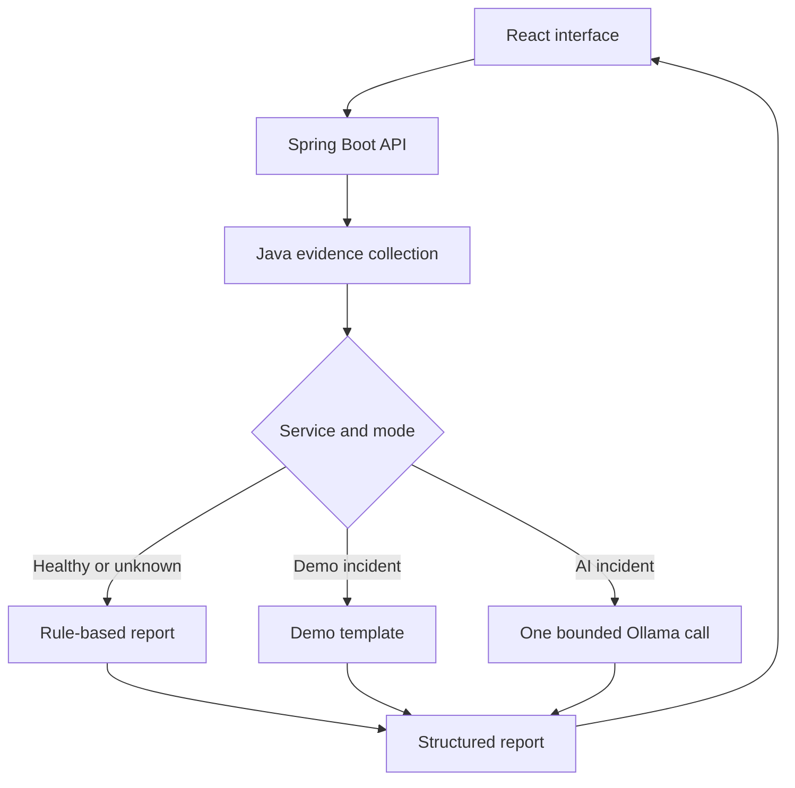

# AI Developer Agent · Incident Desk

A local developer-support portfolio application by **Sajad Ali**, built with **Java 21, Spring Boot, Spring AI, React and Ollama**, with a read-only **MCP server**.

Investigate fictional microservice incidents, inspect the evidence behind a report, and explore how a language model calls Java tools. The UI supports report history, JSON export and a separate tool-calling lab.

> **All service health, logs and deployments are simulated.** This is a learning and portfolio project, not a production incident-management system. Demo mode uses templates; Local AI mode genuinely calls Ollama. The UI labels the source of every result.

**New to the project? Read the [project requirements and step-by-step walkthrough](docs/PROJECT_REQUIREMENTS.md)** for the purpose, features, request flow and acceptance checks.

## What it does

- Investigates payment, order and inventory service scenarios.
- Collects health, application logs and deployment information through read-only Java methods.
- Preserves known service identity, health and evidence in Java. The model cannot overwrite these report fields.
- Uses one model call to suggest causes and next checks for unhealthy services in AI mode.
- Returns healthy and unknown-service reports without a model call.
- Offers a separate agent chat with `@Tool` calling, limited to three tool executions and one call per tool.
- Enforces a model response deadline, output-token budget and single-request admission to prevent request pile-ups.
- Returns structured JSON errors instead of an indefinitely spinning client or fabricated success.
- Exposes the three evidence tools through an optional MCP stdio adapter.

## Start here — no Ollama required

Requirements: **JDK 21**, **Node.js 22.12+**, npm and Git. Maven is supplied through the wrapper. Initial dependency installation needs internet access; demo mode then runs locally.

```bash
git clone https://github.com/alisajadg191/ai-developer-agent.git
cd ai-developer-agent
java -version
./mvnw -version
```

Both Java commands should show version 21. In IntelliJ, set Project SDK and Maven runner JDK to 21.

**Terminal 1 — backend:**

```bash
./mvnw spring-boot:run
```

**Terminal 2 — frontend, from the repository root:**

```bash
npm ci --prefix frontend
npm run dev --prefix frontend
```

Open **http://127.0.0.1:5173**, select a service, leave **Demo** selected and click **Investigate**. The backend is on port 8080. The frontend development server proxies `/api` requests, so no CORS configuration is needed.

The backend root `/` is only a webpage in the packaged build below. During development, use port 5173 for the UI.

### One packaged application

```bash
bash scripts/package.sh
java -jar target/ai-developer-agent-0.0.1-SNAPSHOT.jar
```

Open **http://127.0.0.1:8080**. The script builds React, copies it into Spring Boot's generated static resources, runs backend tests, and creates one executable JAR. Node is needed to build, but not to run the finished JAR. On Windows, use Git Bash for the packaging script, or run backend/frontend separately using `mvnw.cmd`.

## Enable real local AI

1. Install and open [Ollama](https://ollama.com/).
2. Download the model:

   ```bash
   ollama pull llama3.2
   ```

3. Verify generation before starting an AI investigation:

   ```bash
   curl --max-time 30 http://127.0.0.1:11434/api/generate \
     -H 'Content-Type: application/json' \
     -d '{"model":"llama3.2","prompt":"Reply with OK.","stream":false,"options":{"num_predict":16}}'
   ```

4. Start the app, select **Local AI**, and investigate `payment-service` or `inventory-service`.
5. Try the **Tool-calling lab** for model-selected Java tool calls.

No OpenAI key or paid subscription is required. Speed and output quality depend on your machine and model. Healthy and unknown services return rule-based reports even when AI mode is selected; the result explicitly says `RULE_BASED`.

## Tech stack

| Area | Technology |
|---|---|
| Backend | Java 21, Spring Boot 4.1.1, Spring Web MVC |
| AI | Spring AI 2.0.1, Ollama, configurable local model |
| UI | React, Vite, CSS, browser-local report history |
| MCP | Official TypeScript SDK, Node.js stdio server, Zod validation |
| Tests | JUnit 5, Mockito, MockMvc, Ollama-protocol stub, Playwright, Node test runner |
| Build | Maven wrapper, npm lockfiles, GitHub Actions workflow |

Dependency versions are pinned by `pom.xml` and the two npm lockfiles.

## How the investigation works



The separate `/api/ai/chat` endpoint demonstrates dynamic tool calling. The investigation endpoint intentionally uses a fixed collection workflow: all three evidence sources are required, so asking the model to rediscover that sequence adds latency and opportunities for loops.

## API examples

```bash
# Deterministic demo investigation
curl -s http://127.0.0.1:8080/api/ai/investigate \
  -H 'Content-Type: application/json' \
  -d '{"serviceName":"payment-service","mode":"demo"}'

# Real AI interpretation of fixed demo evidence
curl -s http://127.0.0.1:8080/api/ai/investigate \
  -H 'Content-Type: application/json' \
  -d '{"serviceName":"payment-service","mode":"ai"}'

# Model-selected read-only tool calls
curl -s http://127.0.0.1:8080/api/ai/chat \
  -H 'Content-Type: application/json' \
  -d '{"message":"Check payment-service health"}'
```

GET versions of `/api/ai/investigate?serviceName=...&mode=demo` and `/api/ai/chat?message=...` remain for the original tutorial. The GET investigation now defaults to **demo**; add `mode=ai` to invoke Ollama for an unhealthy service.

| Route | Purpose |
|---|---|
| `GET /api/status` | Backend readiness, configured model, model admission status; does not imply Ollama readiness |
| `GET /api/services` | Available fictional service scenarios |
| `GET /api/services/{name}/snapshot` | Raw evidence used by the MCP adapter |
| `POST /api/ai/investigate` | Structured report, `serviceName` and optional `mode` |
| `POST /api/ai/chat` | Tool-calling chat, `message` |

See [API and error reference](docs/API.md).

## Configuration

| Environment variable | Default | Meaning |
|---|---|---|
| `OLLAMA_BASE_URL` | `http://127.0.0.1:11434` | Local Ollama address; numeric address avoids hostname lookup |
| `OLLAMA_MODEL` | `llama3.2` | Model already downloaded into Ollama |
| `MODEL_TIMEOUT_MS` | `45000` | Caller deadline for model work |
| `PORT` | `8080` | Backend port; update Vite/MCP configuration if changed |
| `SERVER_ADDRESS` | `127.0.0.1` | Bind locally by default |

Export variables in your shell or set them in IntelliJ's run configuration. Spring Boot does not automatically read a `.env` file in this project. Do not commit secrets.

The model receives at most 600 output tokens per generation. Chat allows three tool calls total and one per tool. The transport read timeout is 50 seconds. If a caller reaches its 45-second deadline, the model slot remains occupied until the worker really exits; a second AI request returns 429 instead of adding queued work. This bounds caller waiting but cannot guarantee immediate cancellation inside Ollama. Restart Ollama if its runner remains stalled.

## Tests and evaluation

```bash
./mvnw test
npm ci --prefix mcp
npm test --prefix mcp
npm ci --prefix frontend
npm run build --prefix frontend
# Backend must be running for this acceptance script:
python3 scripts/evaluate.py
```

Browser tests (build the JAR first):

```bash
./mvnw package
cd frontend
npx playwright install chromium
npm run test:e2e
```

Tests cover input errors, healthy/unknown cases, fixed evidence, model deadlines, busy admission, real Spring AI serialization with a stub Ollama server, invalid JSON, tool-loop limits, MCP tool discovery/calls, UI reports/export, and visible API errors. Automated tests do **not** establish real model diagnosis quality. See [evaluation results and limitations](docs/EVALUATION.md).

## Read the project after your tutorials

- [Learning guide](docs/LEARNING_GUIDE.md): concepts, reading order and exercises.
- [Architecture and trade-offs](docs/ARCHITECTURE.md): why the workflow changed.
- [Troubleshooting](docs/TROUBLESHOOTING.md): Java, ports, Ollama and timeouts.
- [MCP setup](mcp/README.md): expose the three tools to a compatible local client.
- [Frontend setup](frontend/README.md): development and browser tests.

## Scope and limitations

This release is a local portfolio demo. It has no real monitoring integrations, authentication, persistent server database, RAG, vector database, conversation memory or production remediation. The MCP adapter is a separate server for external clients; the Spring investigation workflow does not consume MCP. React history is stored in this browser and is not model memory.

Known model facts are kept out of generated fields, but model-written hypotheses/checks can still be wrong. JSON schema/shape validation is not fact validation. Every AI report is labelled unverified and requires human review. No automatic fix is executed.

The project was developed with AI assistance. Use it as a working reference, then build understanding through the learning guide. Describe it as a portfolio project rather than commercial production AI experience.
